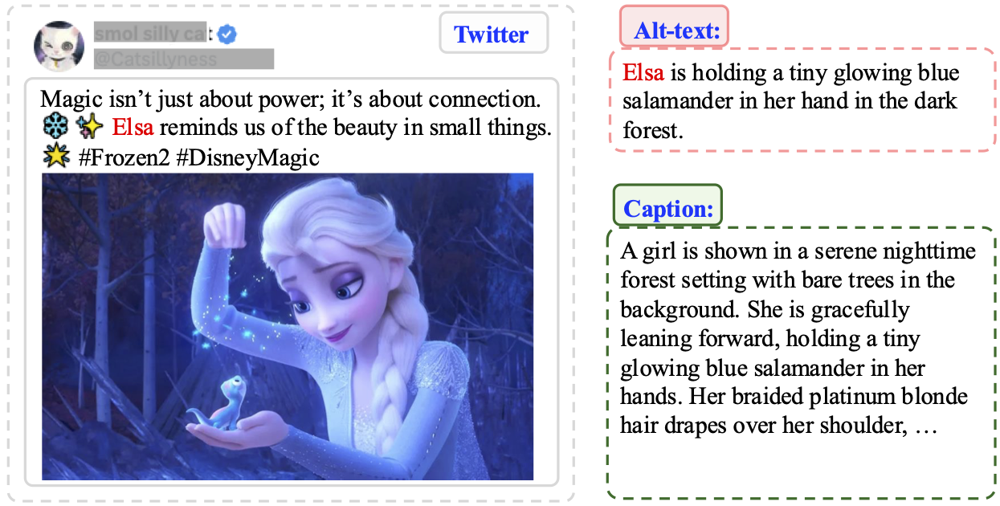
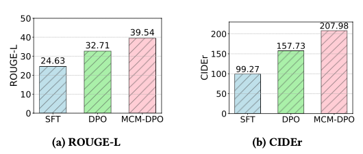
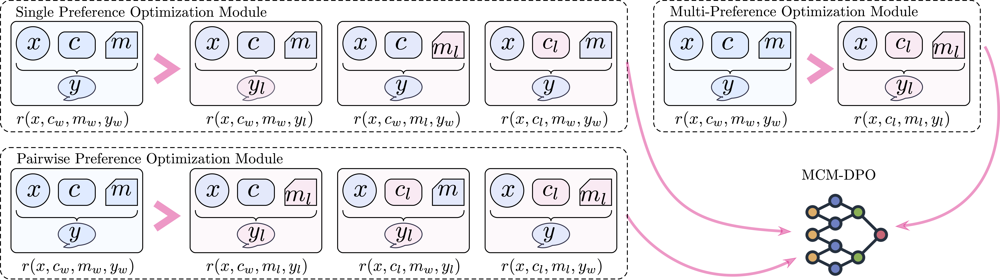
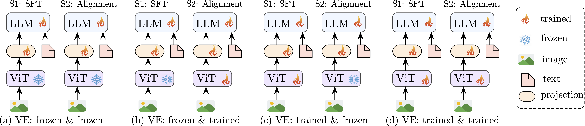

<div align="center">
MCM-DPO: Multifaceted Cross-Modal Direct Preference Optimization for Alter-text Generation
 </div>   

<div align="left">

### ACM MM 2025

### National University of Singapore, Fudan University

This repository provides the code and data for paper: [MCM-DPO: Multifaceted Cross-Modal Direct Preference Optimization for Alter-text Generation](https://arxiv.org/pdf/2510.00647). 


</div>


## Brief Introduction 
### (1) Task: Alt-text Generation

Alt-text generation is the task of automatically producing short textual descriptions for images, typically in the form of alternative text (alt-text) associated with online content. Unlike generic image captioning, which often emphasizes detailed visual narratives, alt-text is designed to be concise, context-relevant, and accessible. Its primary purpose is to support blind and low-vision users, enabling them to perceive and interact with visual information through screen readers or assistive technologies.

<p align="center" width="100%">
<a target="_blank"></a>
</p>

### (2) Main Motivation

Alt-text generation remains challenging despite advances in MLLMs. Current methods, relying on noisy annotations or generic captioning, often produce verbose or irrelevant outputs, resulting in a clear performance gap between model-generated alt-text and human-preferred descriptions. This gap limits accessibility for blind and low-vision users, motivating the need for models that align more closely with human preferences to deliver concise, accurate, and context-aware alt-text.


<p align="center" width="100%">
<a target="_blank"></a>
</p>

 <!--  -->

### (3) The Framework of MCM-DPO
To address these challenges, we propose a novel approach, Multifaceted Cross-Modal Direct Preference Optimization (MCM-DPO), which optimizes preferences across Single Preference, Pairwise Preference, and Multi-Preference dimensions, covering text, image, and cross-modal factors.  

<p align="center" width="100%">
<a target="_blank"></a>
</p>


### (4) Exploration of Training Paradigms

MLLMs typically consist of a vision encoder, a language model, and a projection layer. Most existing approaches freeze the vision encoder and train only the language model and projection, which restricts cross-modal integration and often results in hallucinations and errors. To evaluate how different training paradigms influence MLLMs when adapting to new domains (e.g., social media) and tasks, we investigate four paradigms (illustrated in the following figure). Training follows a two-stage pipeline: (1) supervised fine-tuning (SFT) on large-scale datasets, and (2) preference optimization (DPO or MCM-DPO) on smaller, high-quality datasets. The paradigms examined are:


<p align="center" width="100%">
<a target="_blank"></a>
</p>
 <!--  -->

For more technical details, kindly refer to the our paper.

## Contents
- [1. Preparing Dataset](#data)
- [2. Environment Preparation](#install)
- [3. Training](#training)
- [4. Evaluation](#evaluation)


## 1. Preparing Dataset

To collect a high-quality dataset of human preferences for building an automatic alt-text generation system, we gathered human-annotated alt-text datasets from two widely used social media platforms: Twitter and Pinterestn. 
Sample data from Twitter and Pinterest are provided in the `./data/twitter` and  `./data/pinterest`.

We will release the full training set.


## 2. Environment Preparation

1. Clone this repository and navigate to source folder
```bash
cd MCMDPO
```

2. Build Environment 


```Shell


echo "Creating conda environment"
conda create -n mcmdpo python=3.10
conda activate mcmdpo

echo "Installing dependencies"
pip install -e .
```


## 3. Training
Firstly, configure the training dataset name `data_path` and the checkpoint name `output_dir`.

* #### LLaVA SFT/MCMDPO/DPO Training
```Shell

bash scripts/sft.sh
bash scripts/mcmdpo.sh
bash scripts/dpo.sh
```


## 4. Evaluation

1. Run inference to generate responses

```py
python mcmdpo_inference.py --model_name {ckpt_name} --test_datasets {test_datasets} --eval_output {eval_output} 
```


2. Evaluate the generated responses.

```py
python get_score.py --file {eval_output}
```


## Acknowledgement

Our MCM-DPO is developed based on the codebases of [LLaVA](https://github.com/haotian-liu/LLaVA), and we would like to thank the developers.